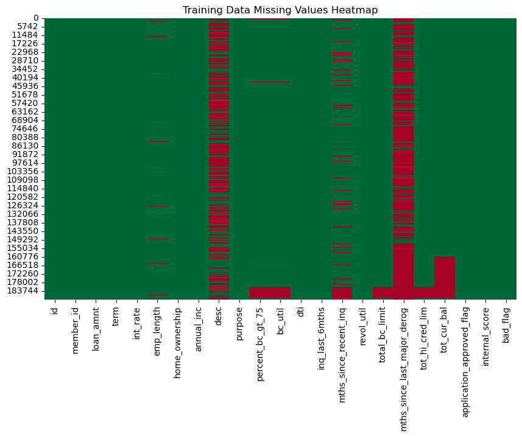
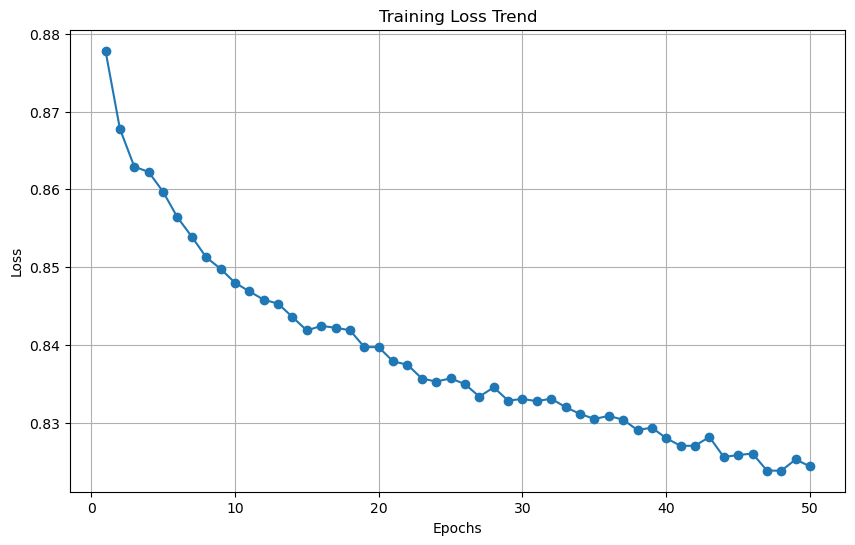
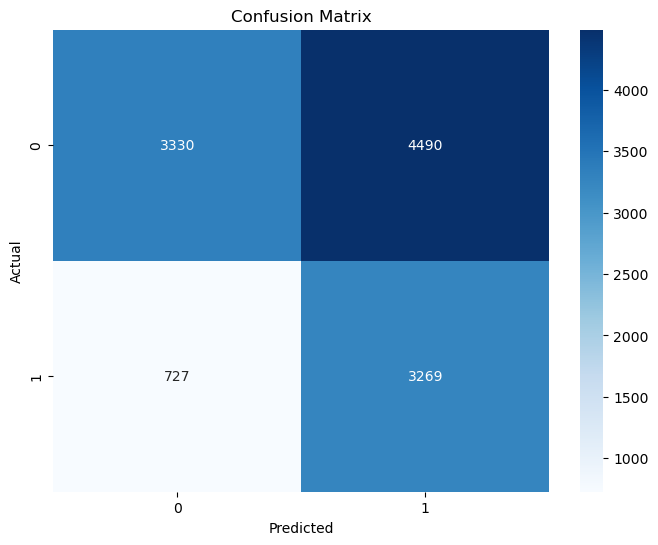
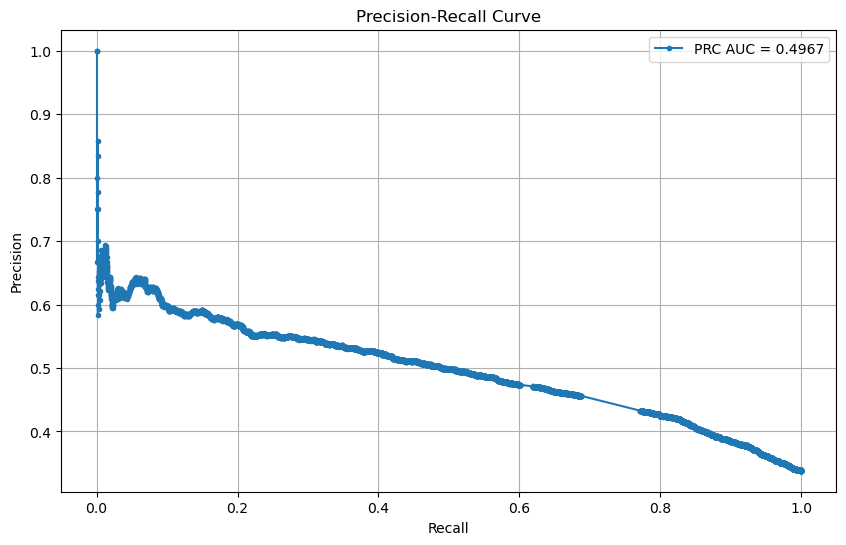
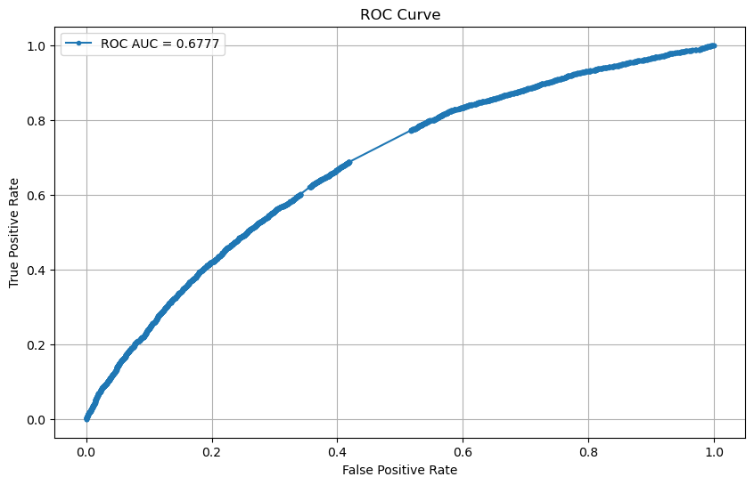

# Loan Default Prediction: EDA and Neural Network Implementation

## **Project Overview**

This project involves two key stages:

1. **Exploratory Data Analysis (EDA)**:
   - Perform data cleaning, handle missing values, detect outliers, and explore relationships in the data.
   - Prepare the dataset for further analysis and modeling.

2. **Neural Network Implementation**:
   - Build, train, and evaluate a neural network using PyTorch to classify loan applications as good or bad (`bad_flag`).
   - Handle class imbalance and optimize the model's performance using advanced evaluation techniques.

### Assumptions

   - Rows with missing bad_flag in the training data are removed.
   - Highly correlated features (total_bc_limit, percent_bc_gt_75, internal_score) are dropped.
   - Class imbalance is addressed using downsampling and weighted loss.
   - Test data features are standardized using the training set statistics to avoid data leakage.
---

## **Project Structure**

The repository includes the following components:

1. **Data**:
   - `training_loan_data.csv`: Raw training dataset.
   - `testing_loan_data.csv`: Raw testing dataset.

2. **Scripts**:
   - `Cleaning_EDA.ipynb`: EDA script to clean, preprocess, and explore the data.
   - `nn_model_script.ipynb`: Jupyter Notebook for building, training, and evaluating the neural network model.

3. **Outputs**:
   - `cleaned_training_dataset.csv`: Cleaned version of the training dataset.
   - `cleaned_testing_dataset.csv`: Cleaned version of the test dataset.
   - `testing_loan_data_with_predictions.csv`: Testing data with predictions.
   - 
4. **Documentation**:
   - `README.md`: Project documentation.

---

## **Setup Instructions**

### 1. Clone the Repository

Clone the repository to your local machine:

```bash
git clone <repository_url>
cd <repository_folder>
```

### 2.Install Dependencies
Install the required Python libraries:

```bash
pip install pandas numpy matplotlib seaborn scikit-learn torch imbalanced-learn
```
The following libraries are required:

pandas
numpy
matplotlib
seaborn
scikit-learn
torch
imbalanced-learn

## **How to Run the Project**

### Step 1: Run EDA
Run the EDA script to clean and analyze the data:

```bash
jupyter notebook Cleaning_EDA.ipynb
```
### Step 2: Run Neural Network Notebook
Open the Jupyter Notebook to build, train, and evaluate the model:
```bash
jupyter notebook nn_model_script.ipynb
```

## **Code Workflow**

### 1. Exploratory Data Analysis (EDA)
#### Data Loading and Cleaning:
  Drop irrelevant and highly missing columns
```bash
drop_columns = ['id', 'member_id', 'desc', 'mths_since_last_major_derog']
train_data.drop(columns=drop_columns, inplace=True)
```
#### Handle Missing Values:
  - Numerical columns filled with the median.
  - Categorical columns filled with 'unknown'.
#### Feature Engineering:

  - Percentage columns `(int_rate, revol_util)` were converted to decimals.
  - `emp_length` and `term` were cleaned and converted to numeric.


#### Visualizations:

  - Missing values heatmap.
  - Categorical distributions with bad_flag (log-scaled).
  - Boxplots and histograms for numerical features.
  - Correlation heatmap
    
### 2. Neural Network Implementation

#### Neural Network Architecture:
The network has:
  - Input Layer: Accepts input_size features as input.
  - Hidden Layer: A fully connected linear layer with hidden_size neurons.
  - ReLU Activation Functions: Applied after each linear transformation to introduce non-linearity.
  - Output Layer: A single neuron that outputs raw values (logits), which can be converted into probabilities using the sigmoid activation function during loss calculation.

#### Neural Network Components

##### `nn.Linear`
The `nn.Linear` module applies a **linear transformation** to the input data:
`y = Wx + b`

Where:
- \( W \) is the **weight matrix** (learnable parameters).
- \( b \) is the **bias term** (learnable parameters).
- \( x \) is the **input** to the layer.

**Purpose**: The linear transformation allows the network to combine input features in a weighted fashion, learning the relationships between features.

##### `nn.ReLU()`
The `nn.ReLU()` module applies the **Rectified Linear Unit (ReLU)** activation function:

`f(x) = Max (0, x)`


This combination allows the neural network to learn and represent complex data relationships.

#### Training Loop:
   - Balanced the dataset using downsampling.
   - The data flows sequentially through:
Input → fc1 → ReLU → fc2 → ReLU → fc3 → Output.
   - Logits Output:
      - The final output is raw values (logits), which are suitable for use with the binary cross-entropy loss (BCEWithLogitsLoss).
      - The sigmoid function is applied internally in the loss function for stability.

   - Class Imbalance is addressed using a weighted loss function:
```bash
pos_weight = torch.tensor([len(y_train) / sum(y_train) - 1], dtype=torch.float32)
criterion = nn.BCEWithLogitsLoss(pos_weight=pos_weight)
```
   - Optimization: Adam optimizer with a learning rate of 0.01.

#### Model Evaluation:

Metrics:
   - Accuracy
   - Precision
   - Recall
   - F1 Score
   - ROC-AUC,Precision-Recall Curve
   - Confusion Matrix


# Visualizations, Results and Insights

## EDA:
   - **The bad_flag target variable is highly imbalanced.**

   - High Missing Columns:
      - Columns like `desc` and `mths_since_last_major_derog` have excessive missing data and can be dropped unless domain knowledge suggests otherwise.
   - Moderate Missing Columns:
      - Columns with scattered missing values `(emp_length, bc_util, revol_util, etc.)` should be imputed using appropriate methods (median for numerical, 'unknown' for categorical).

   - Features like `loan_amnt, annual_inc, dti, and emp_length` show skewed distributions and outliers.
      - Outliers were identified using boxplots but not removed, assuming further modeling will handle them.
        
   - Insights from the Correlation Heatmap:
      - Some features are highly correlated with each other:
        - `total_bc_limit` and `tot_hi_cred_lim` (correlation ≈ 1.00)
        - `percent_bc_gt_75` and `bc_util` (correlation ≈ 0.83)
        - `loan_amnt` and `internal_score` (correlation ≈ 1.00)
      - bad_flag shows weak correlations with most numerical features.
      - Features like **annual_inc**, **dti**, **term**, and **int_rate** show slightly higher correlation but are still low (< 0.2), indicating limited linear relationships.
   - Actions to Consider
      - Feature Selection: Remove or combine highly correlated features to reduce multicollinearity.
      - Advanced Modeling: Use non-linear models or interaction terms since weak correlations suggest limited linear relationships with bad_flag.
      - Domain Knowledge: Verify the importance of feature relevance.

## Neural Network Insights

### 1. Training Loss Trend

   - Observation:
      - The loss steadily decreases over 50 epochs, indicating that the model is learning and optimizing effectively.
      - There are minor fluctuations, but the overall trend is downward.
   - Insight:
      - The model shows good convergence, suggesting that the learning rate and optimizer are appropriately configured.
      - However, the plateau in later epochs indicates that further fine-tuning (e.g., regularization or early stopping) might be explored.
### 2. Confusion Matrix

   - Observation:
      - There is a high number of False Positives (4,490), indicating that the model incorrectly predicts "bad loans" often.
      - Recall (0.8133) is high, showing that the model successfully identifies a large portion of the actual bad loans.
   - Insight:
      - The model prioritizes Recall (identifying bad loans) over Precision (minimizing false alarms).
      - This is suitable for the given use case, where detecting bad loans is critical, even at the cost of some false positives.
### 3. Precision-Recall Curve

   - Observation:

      - Precision remains moderate at lower recall values and starts to decrease as recall increases.
      - The AUC score (0.4967) suggests the model has room for improvement in balancing precision and recall.

   - The model's performance on imbalanced data can be improved further through:
      - Adjusting the classification threshold.
      - Applying techniques such as SMOTE or class-weighted loss functions.
      - Experimenting with model architecture or ensemble methods.
### 4. ROC Curve

   - Observation:

      - The AUC score (0.6777) indicates that the model performs moderately well at distinguishing between the two classes (bad and good loans).
      - The curve is above the random baseline but does not reach a near-perfect area under the curve.
   - Insight:

      - A ROC AUC of 0.68 indicates the model has learned some meaningful patterns but lacks strong discriminative power.
   - Further improvements could include:
      - Feature engineering: Add interaction features or remove irrelevant ones.
      - Model tuning: Increase hidden layer neurons, optimize learning rate, or try other architectures (e.g., deeper networks).
### 5. Final Metrics at Best Threshold (0.35)
Accuracy: 0.5585
Precision: 0.4213
Recall: 0.8181
F1 Score: 0.5562
   - Observation:

      - The threshold of 0.35 was selected to optimize the F1 Score (0.5562).
      - High Recall (0.8181) comes at the cost of lower Precision (0.4213).
      - The overall Accuracy (0.5662) reflects the challenge of working with imbalanced data.
   - Insight:

      - This threshold prioritizes reducing False Negatives, which aligns with the goal of identifying as many bad loans as possible.However, the low Precision suggests many False Positives, which might cause unnecessary interventions in downstream processes.
### Key Recommendations for Improvement
   - Threshold Optimization:
         - Experiment with additional thresholds to find a better balance between Precision and Recall, depending on business requirements.
   - Imbalanced Data:
         - Further address class imbalance using oversampling techniques (e.g., SMOTE) or under-sampling of the majority class.
   - Model Architecture:
         - Add more hidden layers or experiment with dropout regularization to improve generalization.
   - Ensemble Methods:
         - Combine the neural network with tree-based models (e.g., Random Forest, XGBoost) for better performance.
   - Feature Engineering:
         - Add interaction terms or domain-specific features to help the model better distinguish between classes.


